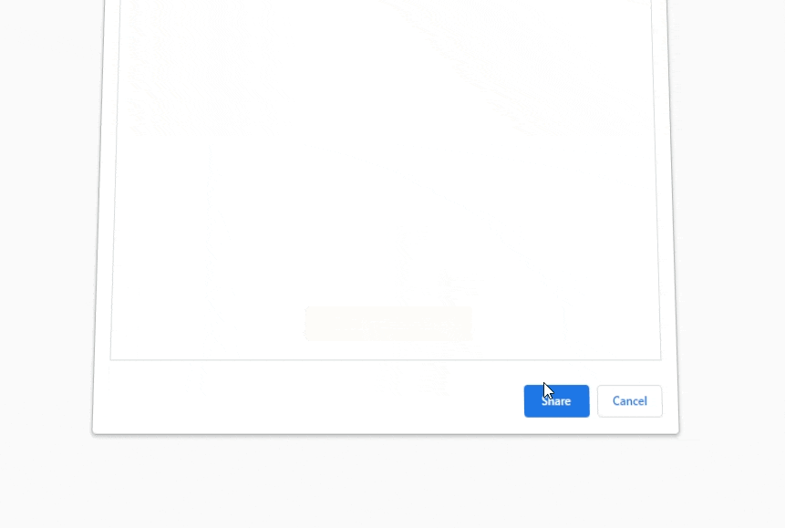
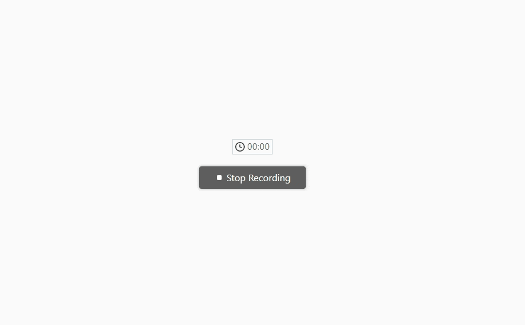
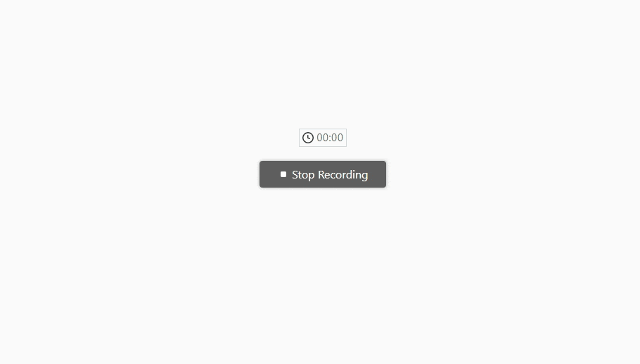
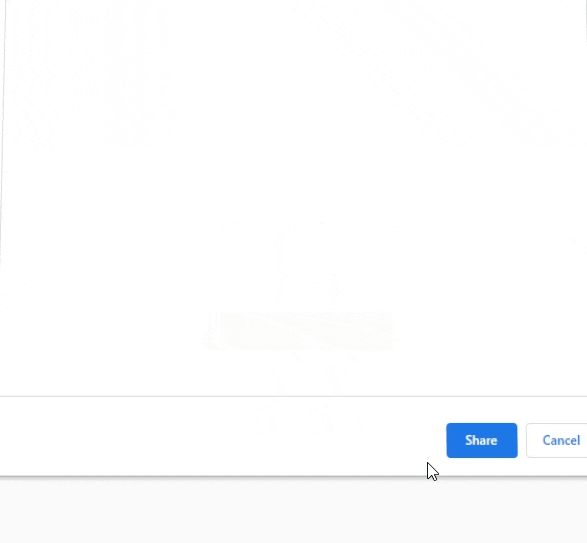
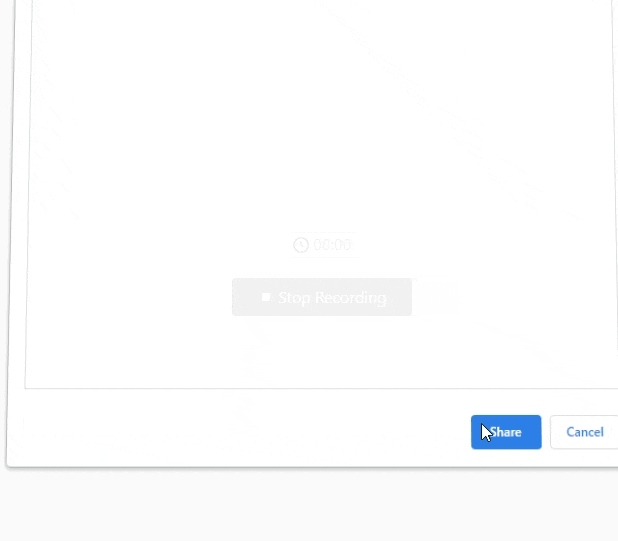

# SCRABBLE SCOREKEEPER WINFORMS DESKTOP APPLICATION

<!-- ABOUT THE PROJECT -->
## About The Project

* It is a CRUD desktop application developed in WinForms that targets .NET Framework 4.7.2
* This is the desktop version of Scrabble Scorekeeper

## Built With
* C#
* SQL Server
* Dapper
* T-SQL queries
* LINQ queries
* xUnit for Unit Testing 
* Visual Studio 2019

## Design Features
* The solution is organised in 3 projects: the UI, a class library and the data access layer
* Dapper, LINQ and SQL queries are used to map objects and manipulate data
* The class library was built using a Test-Driven Development approach
* Robust data validation preserves the system from manipulating bad data

## Overview

* ### Add players and their scores during each round. Tally the results and display them in the scoreboard

* ### By using the same username the stats get updated after each game

* ### Delete players from the database

## Data Validation

* ### Users can't enter null/empty data to the database

* ### Negative scores and non-numerical entries are not allowed

